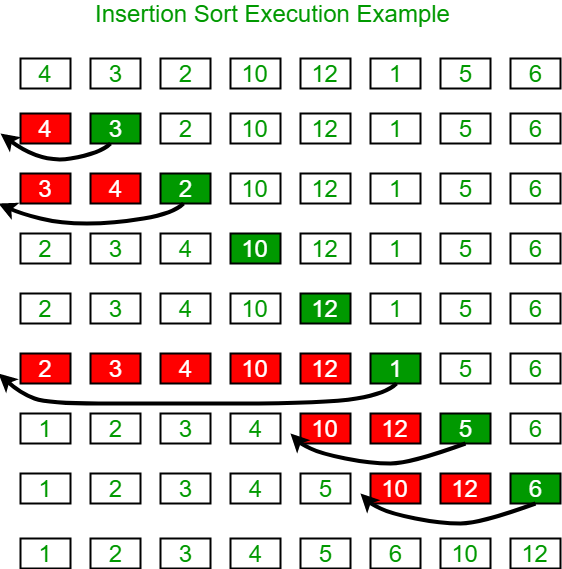

# Insertion Sort
Insertion sort is a simple sorting algorithm that builds the final sorted array one item at a time. It is much less efficient on large lists than more advanced algorithms such as quicksort, heapsort, or merge sort.

<center></center>

```python
def insertionSort(dat):
    arr = dat.copy() #prevent in-place sorting
    l = len(arr)

    for i in range(1, l):
        key = arr[i]
        for j in range(i-1,-1,-1):
            if arr[j] > key:
                arr[j+1] = arr[j]
            else:
                break
        arr[j] = key
    return arr
```

## Reference
1. https://en.wikipedia.org/wiki/Insertion_sort
2. https://www.geeksforgeeks.org/insertion-sort/