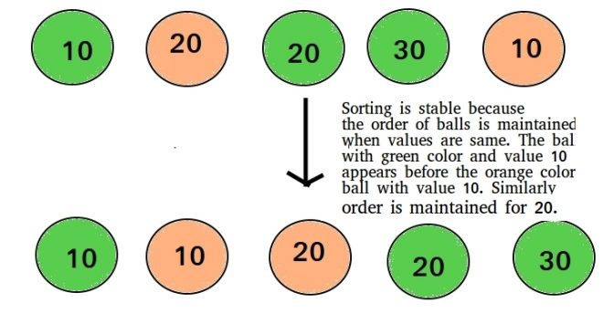

# Stability of Sorting Algorithms

Sorting algorithm is stable if equivalent elements retain their relative positions after sorting. For instance, let A be an array that contains the following list [9,1,1,3,6,9]. If the outcome of the sorting results in relative positions of the same elements, which in this case are 1 and 9, then the algorithm is recognized as stable. The following figure visually explains the concept acquired from https://www.geeksforgeeks.org/stability-in-sorting-algorithms/.

